# KumbhSafe — Architecture Document

> **Platform:** Real-time crowd safety intelligence for Nashik Simhastha Kumbh Mela 2027  
> **Scale:** 80 million pilgrims · 22.5 million peak single day · 12 zones · 2 cities · Monsoon season  
> **Stack:** AWS DynamoDB · Aurora DSQL · Bedrock AgentCore · Strands Agents · Vercel · Cloudscape

---

## Table of Contents

1. [System Overview](#1-system-overview)
2. [High-Level Architecture](#2-high-level-architecture)
3. [Crowd Density Data Pipeline](#3-crowd-density-data-pipeline)
4. [Multi-Agent Orchestration](#4-multi-agent-orchestration)
5. [Agent Invocation Sequence](#5-agent-invocation-sequence)
6. [Aurora DSQL Schema](#6-aurora-dsql-schema)
7. [DynamoDB Access Patterns](#7-dynamodb-access-patterns)
8. [Authentication & RBAC Flow](#8-authentication--rbac-flow)
9. [Zone Status State Machine](#9-zone-status-state-machine)
10. [Alert Lifecycle](#10-alert-lifecycle)
11. [Pilgrim SOS Emergency Flow](#11-pilgrim-sos-emergency-flow)
12. [Platform Configuration Flow](#12-platform-configuration-flow)
13. [AWS CDK Deployment Order](#13-aws-cdk-deployment-order)
14. [Multi-Region Failover](#14-multi-region-failover)
15. [Event Bus Routing](#15-event-bus-routing)
16. [API Request Lifecycle](#16-api-request-lifecycle)

---

## 1. System Overview

KumbhSafe operates across two simultaneous command centres — Nashik (Ramkund ghats) and Trimbakeshwar (Kushavart Kund) — 30 km apart via a single mountain road. The platform ingests real-time crowd density from IoT sensors and CCTV, processes it through six Strands-powered agents deployed on AWS Bedrock AgentCore, and surfaces actionable intelligence to 7 user roles through a Cloudscape dashboard deployed on Vercel.

**The three failure modes that must never happen:**
- Kushavart Kund exceeding 1,900 persons without an immediate entry hold
- A critical alert not reaching NDRF within 60 seconds
- CrowdSentinel silently failing during active bathing hours (0600–2200 IST)

All three are protected by hard-coded rules in stream processors — not dependent on AI agent availability.

---

## 2. High-Level Architecture

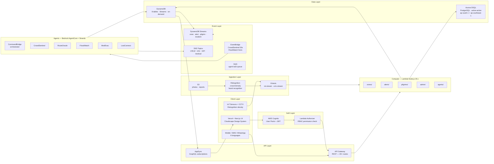

---

## 3. Crowd Density Data Pipeline

This pipeline runs continuously — every 30 seconds during active hours, ingesting sensor and camera data, computing zone density, and pushing live updates to every connected ICCC operator dashboard.

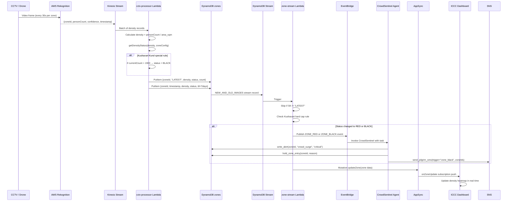

---

## 4. Multi-Agent Orchestration

CommandBridge is the orchestrating agent. It has one tool no other agent has: `invoke_child_agent`. All specialist agents are stateless — they read from DynamoDB, write to DynamoDB, and publish to SNS. They share a common tool library from `shared/dynamo_tools.py`.

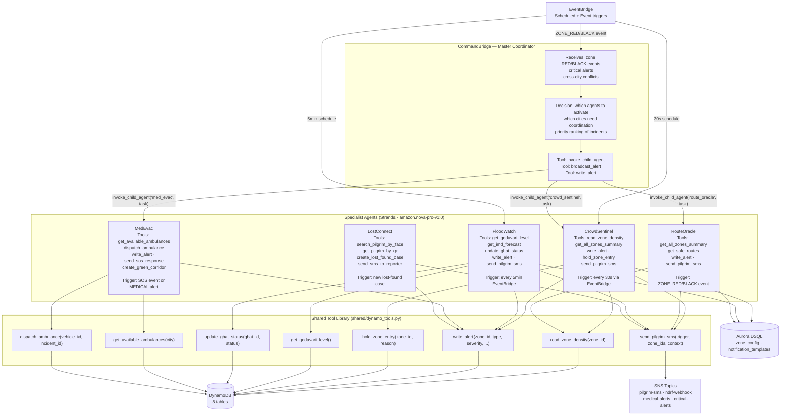

---

## 5. Agent Invocation Sequence

Shows the full path from EventBridge trigger → Bedrock AgentCore → Strands agent → tool execution → DynamoDB write → alert stream → ICCC notification.

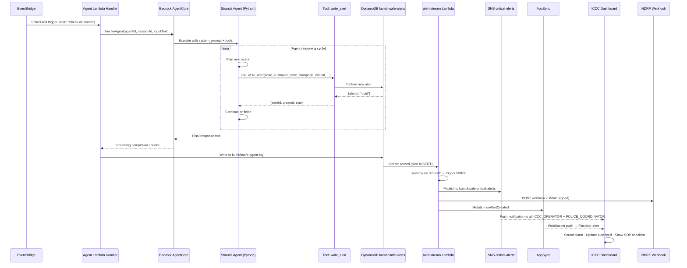

---

## 6. Aurora DSQL Schema

Complete entity-relationship diagram for all Aurora DSQL tables. Aurora DSQL is the source of truth for platform configuration, user management, audit history, and all relational data.

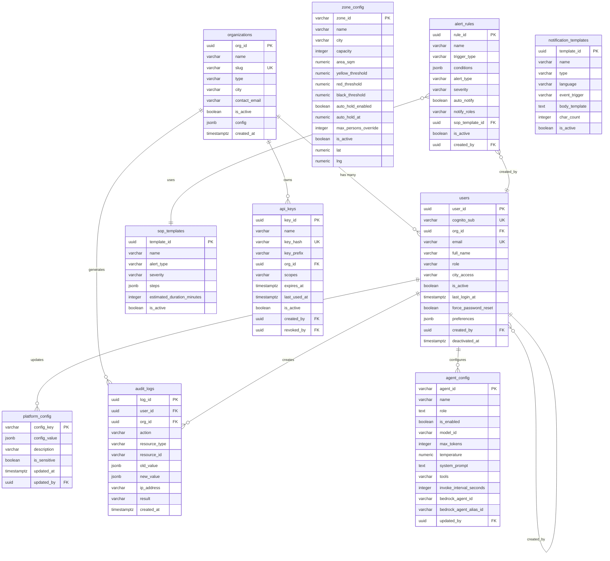

---

## 7. DynamoDB Access Patterns

All DynamoDB tables use separate table design (not single-table) for domain clarity. The `LATEST` SK pattern enables both current-state reads and time-series queries from the same table.

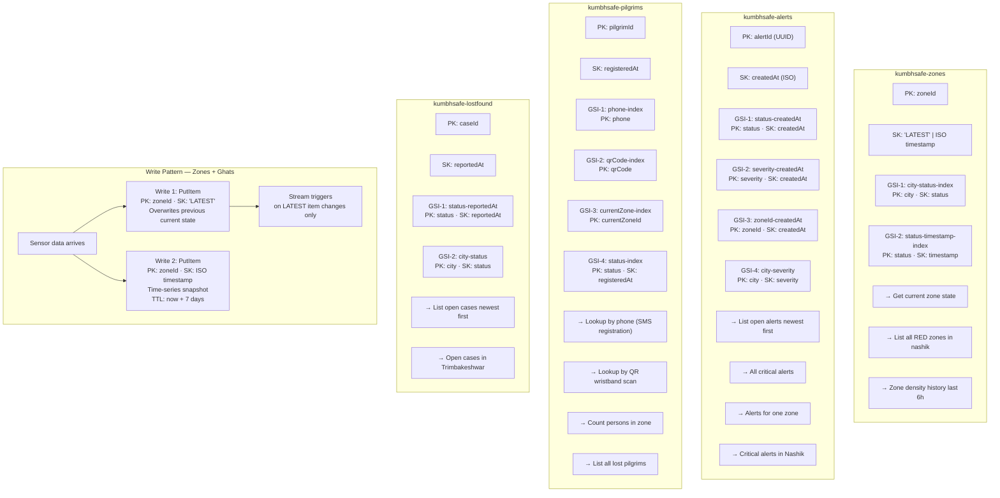

---

## 8. Authentication & RBAC Flow

Every API request goes through Cognito JWT verification followed by a permission check against the RBAC matrix. The user's `city_access` attribute adds an extra data-level filter on top of permission checks.

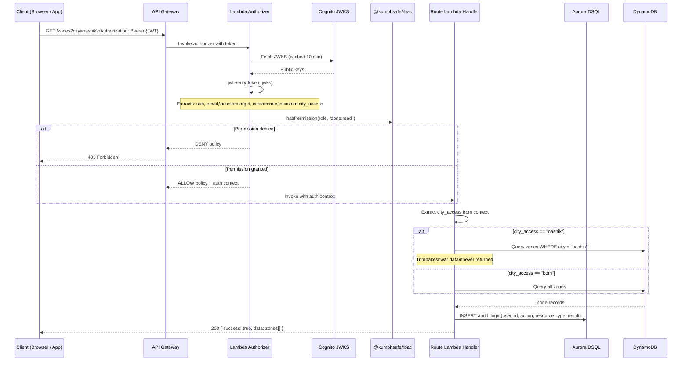

---

## 9. Zone Status State Machine

Zone status transitions are driven by crowd density thresholds defined in `zone_config` per zone (not global). Kushavart Kund has custom lower thresholds. Some transitions require human authorization; others are automatic.

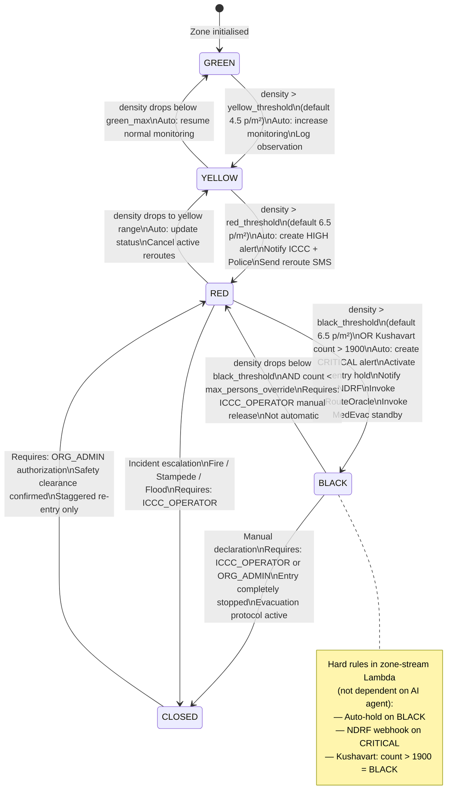

---

## 10. Alert Lifecycle

Alerts are immutable once created. Only `status`, `acknowledgedBy`, `acknowledgedAt`, `assignedTo`, `resolvedBy`, `resolvedAt` can be updated after creation. The `alertId`, `type`, `severity`, `createdAt`, `agentSource`, and `zoneId` are locked.

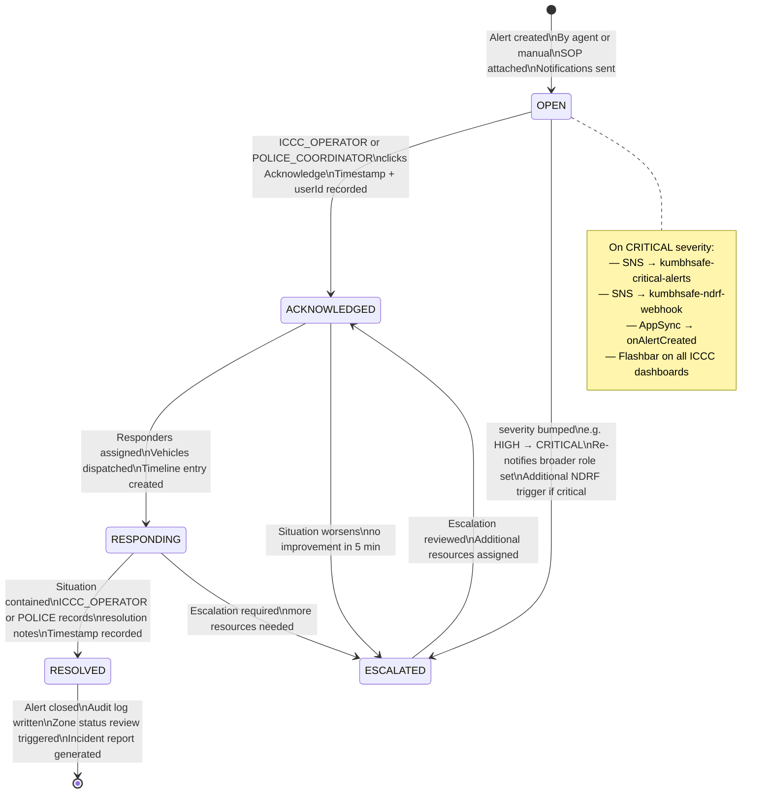

---

## 11. Pilgrim SOS Emergency Flow

A pilgrim in distress triggers SOS via mobile app, SMS shortcode (*555), or QR wristband scan at a help kiosk. MedEvac agent must dispatch an ambulance and confirm response within 8 seconds.

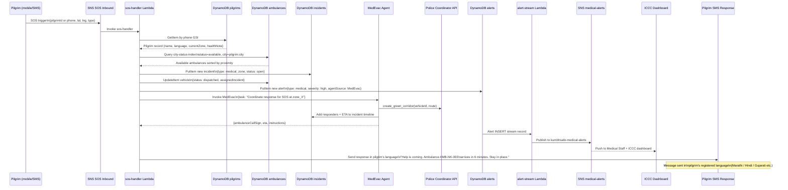

---

## 12. Platform Configuration Flow

The Super Admin controls the entire platform through Aurora DSQL configuration tables. Changes propagate to all Lambdas within 60 seconds via a DynamoDB config cache layer.

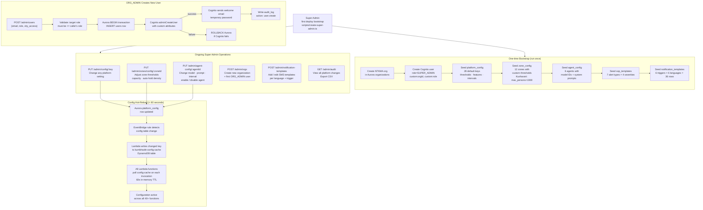

---

## 13. AWS CDK Deployment Order

Stacks have explicit dependencies. Deploy in order — each stack exports values consumed by subsequent stacks.

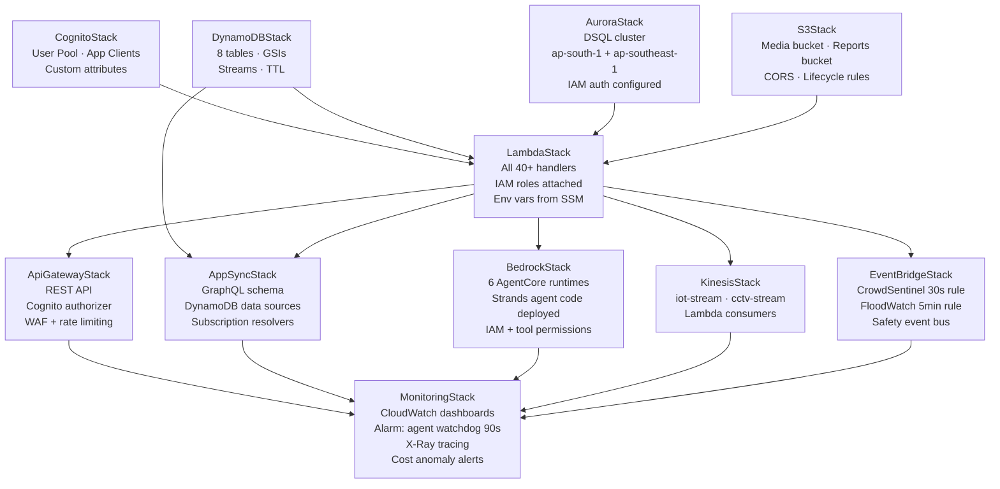

**Post-deploy bootstrap (run in order):**

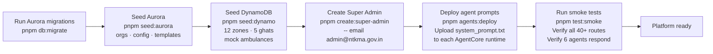

---

## 14. Multi-Region Failover

Aurora DSQL provides active-active replication across two regions. DynamoDB uses global tables for cross-region replication of operational data. The frontend on Vercel serves from edge nodes globally.

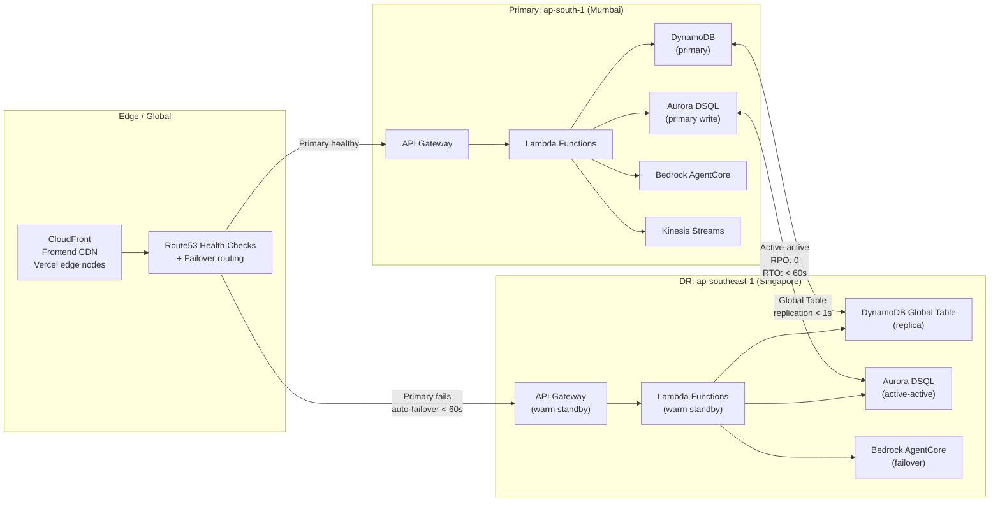

---

## 15. Event Bus Routing

All asynchronous events flow through EventBridge as the central message broker. Each event type has a defined pattern and one or more Lambda targets.

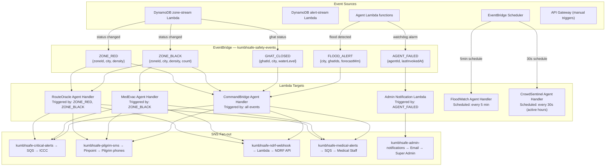

---

## 16. API Request Lifecycle

Complete lifecycle of a PATCH request to hold a zone — from client click to DynamoDB write to real-time dashboard update.

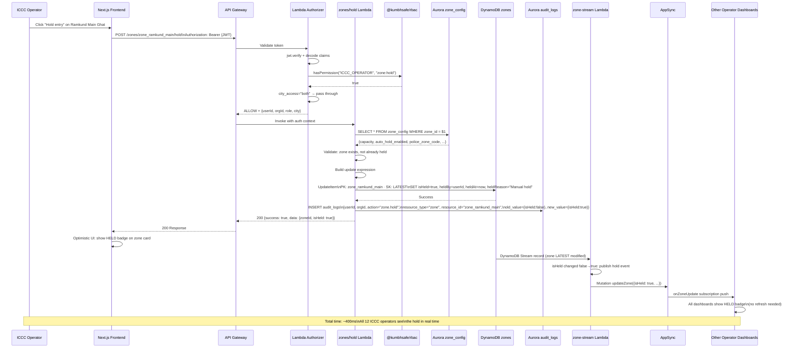

---

## Key Architectural Decisions

| Decision | Choice | Rationale |
|---|---|---|
| Primary DB for real-time | DynamoDB | 200K writes/hr burst, sub-10ms latency, no capacity planning |
| Config / relational DB | Aurora DSQL | SQL joins, active-active multi-region, zero RPO for config data |
| Agent framework | Strands + Bedrock AgentCore | Managed runtime, no cold starts, native tool-use, Python ecosystem |
| Real-time push | AppSync subscriptions | WebSocket built-in, DynamoDB resolver, no polling |
| Ingestion | Kinesis | Ordered, replay-capable, scales to millions of sensor events/hr |
| Frontend | Vercel + Cloudscape | Cloudscape: AWS-native operational UI patterns; Vercel: zero-config deploy |
| Multi-user auth | Cognito + custom attributes | Managed JWT lifecycle, orgId + role + city in token claims |
| Audit trail | Aurora (append-only) | Immutable, SQL-queryable, cross-joined with user/org data, exportable |
| Agent invocation | EventBridge schedule | Decoupled, retry-capable, catchup on Lambda failures, no tight Lambda→Lambda coupling |
| Safety rules | Stream Lambda (not agents) | Hard rules cannot depend on AI availability. Kushavart cap + NDRF notify are code, not prompts |

---

*Document version: 1.0 · Platform: KumbhSafe · Event: Nashik Simhastha Kumbh Mela 2027*  
