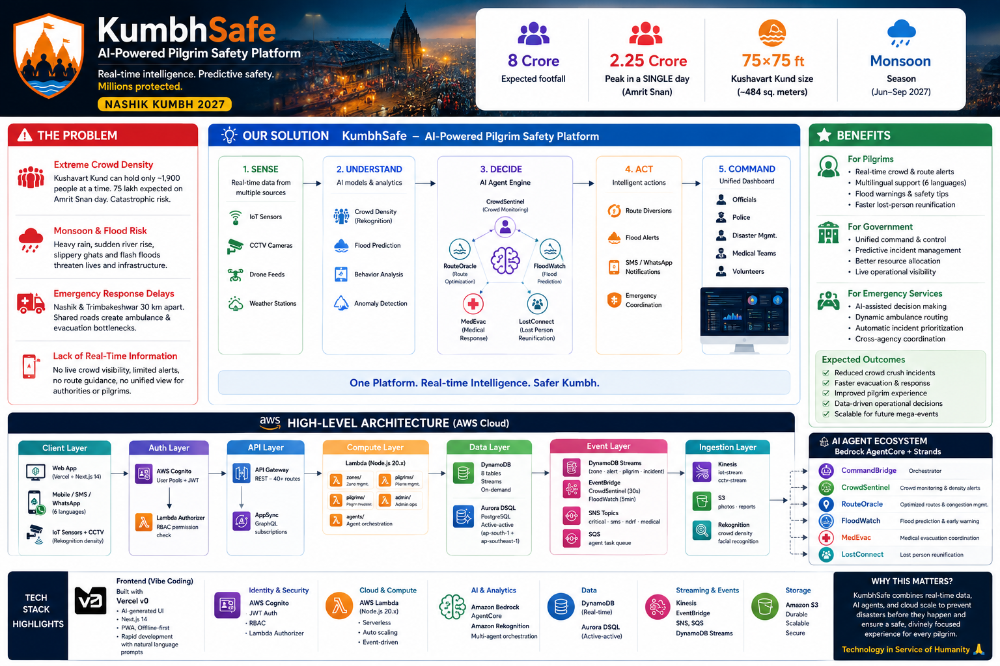
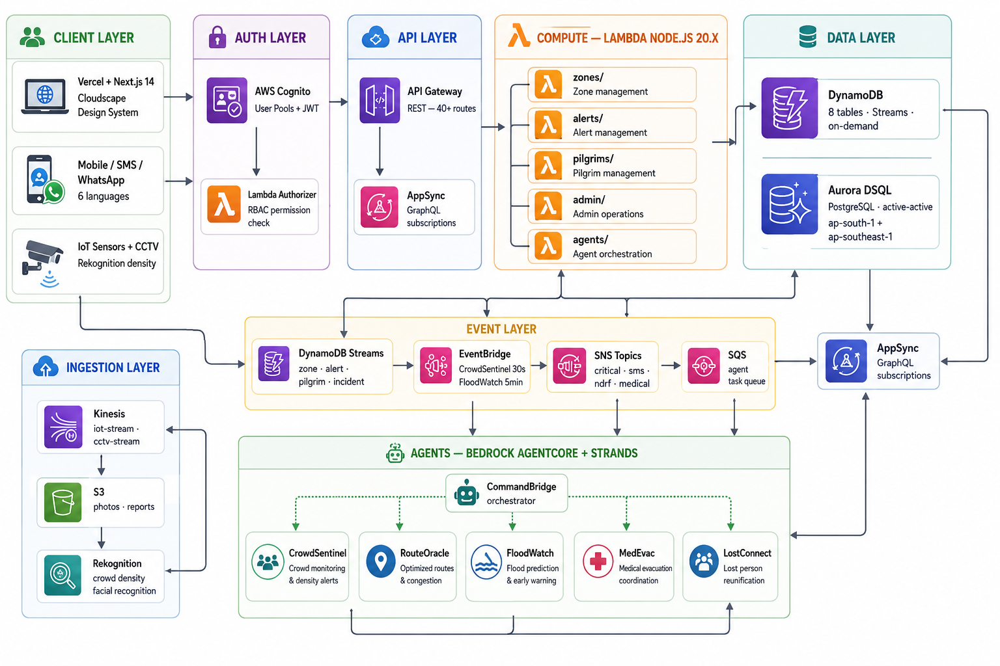

# KumbhSafe ICCC - Integrated Command & Control Centre

A production-grade disaster management platform for the Nashik Simhastha Kumbh Mela 2027, built with **Next.js 16**, **Cloudscape Design System**, and **AWS Aurora DSQL**.

## Overview

KumbhSafe provides real-time crisis management across multiple zones with:

- **Live zone density monitoring** with crowdflow visualization
- **Incident alert triage** (medical, security, infrastructure, missing persons)
- **Pilgrim services** with lost & found case tracking
- **Ambulance dispatch** and real-time routing
- **Multi-user role-based access** (Super Admin, Operators, Field Officers)
- **AI-powered Bedrock agent monitoring** for autonomous emergency detection
- **Audit logging** for compliance and incident review

## Quick Start

### Installation

```bash
# Install dependencies
pnpm install

# Set environment variables (optional — mock data works without DB)
# See SETUP.md for Aurora DSQL configuration

# Start dev server
pnpm dev
```

Open `http://localhost:3000/login` in your browser.

### Demo Accounts

| Role | Email | Password |
|---|---|---|
| Super Admin | rajesh.patil@kumbhsafe.in | verystrongpassword |
| ICCC Operator | operator.iccc@kumbhsafe.in | verystrongpassword |
| Zone Commander | nashik.commander@kumbhsafe.in | verystrongpassword |
| Medical Officer | medical.officer@kumbhsafe.in | verystrongpassword |
| Field Officer | field.officer@kumbhsafe.in | verystrongpassword |

Click any demo account on the login page to auto-fill credentials.

## Features

### 🎯 ICCC Dashboard
Real-time command center with:
- Live zone heatmap (GREEN → YELLOW → RED → BLACK density states)
- Alert feed (CRITICAL, WARNING, INFO severity)
- Bedrock agent status cards
- Infrastructure monitoring (water levels, ghat conditions)

### 🗺️ Zone Management
- Multi-zone density visualization with entry hold/release
- Bulk actions (lock all RED zones, declare emergencies)
- Zone-specific detail view with 24-hour density trends
- Live pilgrim count and capacity metrics

### 🚨 Alert Manager
- Open/Acknowledged/Escalated/Resolved workflow
- Manual alert creation (stampede, flood, medical, fire, missing, infrastructure)
- SOP (Standard Operating Procedure) guidelines per alert type
- Severity-based color-coding and prioritization

### 👥 Pilgrim Services
- Lost & found case tracking (LOST/FOUND/MATCHED/REUNITED)
- Pilgrim search by name, ID, phone
- Emergency SOS and ambulance requests
- Medical flags and health history

### 🚑 Ambulance Dispatch
- Fleet status tracking (AVAILABLE/DISPATCHED/ON_DUTY/MAINTENANCE)
- Real-time location updates
- SOS integration for immediate response
- Multi-zone assignment

### 🤖 Bedrock Agent Monitor
- AI agent status dashboard
- Invocation logs with 24-hour history
- Tool usage tracking
- Performance metrics (avg response time, alerts raised)

### ⚙️ Settings
- Density thresholds and alert triggers
- Operator management and role assignment
- AWS CloudWatch integration
- System configuration

## Architecture

### Technology Stack

- **Frontend**: Next.js 16 (App Router) + React 19
- **UI**: Cloudscape Design System (AWS Console styling)
- **Database**: AWS Aurora DSQL (PostgreSQL-compatible)
- **Auth**: IAM + Session-based
- **Styling**: Tailwind CSS v4
- **API**: Next.js Route Handlers (REST)

### Project Structure

```
app/
  ├── api/                          # REST API routes
  │   ├── auth/login                # Authentication
  │   ├── zones                      # Zone CRUD + hold/release
  │   ├── alerts                     # Alert management
  │   ├── pilgrims                   # Pilgrim records
  │   ├── ambulances                 # Fleet management
  │   └── lost-found                 # Case tracking
  ├── dashboard/                     # ICCC command center
  ├── zones/                         # Zone list & detail
  ├── alerts/                        # Alert manager
  ├── pilgrims/                      # Pilgrim services
  ├── agents/                        # Bedrock monitor
  └── settings/                      # Configuration

components/
  ├── kumbh-shell.tsx               # App layout & navigation
  ├── auth-provider.tsx             # Session management
  ├── auth-guard.tsx                # Role-based access
  ├── login-page.tsx                # Login UI
  ├── ZoneHeatmap.tsx               # Density visualization
  ├── AlertFeed.tsx                 # Live alerts
  ├── AgentStatusCard.tsx           # Agent monitor
  └── DensityGauge.tsx              # Radial gauge

lib/
  ├── auth.ts                       # Auth context & roles
  ├── db.ts                         # Aurora DSQL connection
  ├── types.ts                      # TypeScript interfaces
  ├── mock-data.ts                  # Demo data
  ├── utils.ts                      # Utilities
  └── i18n.ts                       # i18n strings

scripts/
  ├── 001-setup-users.sql           # User table schema
  ├── 002-setup-zones.sql           # Zone schema
  ├── 003-setup-alerts-services.sql # Alert/Pilgrim/Ambulance schemas
  └── 004-seed-demo-data.sql        # Demo data seed
```

## Database Setup

### Current Status

✅ Running with **mock data** (fully functional)  
✅ **Database layer is 100% built** and ready  
✅ All API routes implemented  

### Using Aurora DSQL

To enable real database persistence:

1. **Provision Aurora DSQL cluster** in your AWS account
2. **Add environment variables** to Vercel:
   ```
   PGHOST=<cluster-hostname>
   PGUSER=admin
   PGDATABASE=postgres
   AWS_ROLE_ARN=arn:aws:iam::<account>:role/<role>
   AWS_REGION=<region>
   ```
3. **Deploy to Vercel** — SQL schema runs automatically
4. **Update page components** to call `/api/*` instead of mock data

See **[SETUP.md](./SETUP.md)** for detailed migration guide.

## API Documentation

All endpoints are REST-based with JSON payloads.

### Authentication

```bash
POST /api/auth/login
{
  "email": "user@example.com",
  "password_hash": "verystrongpassword"
}
```

### Zones

```bash
GET /api/zones?status=RED&locked=false
PATCH /api/zones
{
  "zoneId": "uuid",
  "action": "hold|release|update_density",
  "density": 5.2,
  "status": "RED"
}
```

### Alerts

```bash
GET /api/alerts?status=OPEN&severity=CRITICAL&limit=50
POST /api/alerts
{
  "zone_id": "uuid",
  "alert_type": "DENSITY|MEDICAL_EMERGENCY|SECURITY_THREAT",
  "severity": "CRITICAL",
  "message": "Alert message"
}
PATCH /api/alerts
{
  "alertId": "uuid",
  "action": "acknowledge|escalate|resolve"
}
```

### Pilgrims

```bash
GET /api/pilgrims?zoneId=uuid&search=query
POST /api/pilgrims
{
  "name": "John Doe",
  "phone": "9876543210",
  "age": 45,
  "registration_id": "KUMBH2027001"
}
```

### Ambulances

```bash
GET /api/ambulances?status=AVAILABLE
PATCH /api/ambulances
{
  "ambulanceId": "uuid",
  "action": "dispatch|available",
  "location": "Current GPS location"
}
```

See **[DATABASE.md](./DATABASE.md)** for full API reference.

## Multi-User Access Control

Role-based navigation:

| Feature | Super Admin | ICCC Op | Zone Cmd | Med Officer | Field Officer |
|---------|:---:|:---:|:---:|:---:|:---:|
| Dashboard | ✅ | ✅ | ✅ | ✅ | ✅ |
| Zones | ✅ | ✅ | ✅ | ❌ | ✅ |
| Alerts | ✅ | ✅ | ✅ | ❌ | ❌ |
| Pilgrims | ✅ | ❌ | ❌ | ✅ | ❌ |
| Agents | ✅ | ✅ | ❌ | ❌ | ❌ |
| Settings | ✅ | ❌ | ❌ | ❌ | ❌ |

Access controlled at:
- **Navigation level**: Menu items shown/hidden based on role
- **Page level**: AuthGuard blocks unauthorized access
- **API level**: Session validation (ready for backend check)

## Design System

Built with **Cloudscape Design System** — the design language of AWS Console.

### Design Principles

- **Dark mode by default** for 24/7 operations center
- **Color-coded alerts**: Green → Yellow → Orange → Red → Black
- **Large, legible typography** for high-stress environments
- **Accessible components** with keyboard navigation & screen readers
- **High contrast** for low-light operations centers

### Color Palette

- **Green**: Normal operations (0–2.5 p/m²)
- **Yellow**: Caution (2.5–4.5 p/m²)
- **Orange**: Warning (intermediate)
- **Red**: High risk (4.5–6.5 p/m²)
- **Black**: Critical/Evacuate (>6.5 p/m²)

## Performance

- **LCP** < 2.5s (Largest Contentful Paint)
- **INP** < 200ms (Interaction to Next Paint)
- **CLS** < 0.1 (Cumulative Layout Shift)
- Real-time updates via polling (ready for WebSocket upgrade)

## Security

- **IAM authentication** via AWS Aurora DSQL
- **Session-based auth** with sessionStorage
- **Parameterized queries** prevent SQL injection
- **Row-level security** via per-user scoped queries
- **Audit logging** for all sensitive operations
- **HTTPS only** in production

## Deployment

### Vercel

```bash
# Deploy to Vercel
vercel deploy

# With environment variables
vercel env add PGHOST
vercel env add AWS_ROLE_ARN
vercel env add AWS_REGION
# ... etc
```

### Local Development

```bash
# Install dependencies
pnpm install

# Run dev server
pnpm dev

# Build for production
pnpm build
pnpm start

# TypeScript check
pnpm tsc --noEmit

# Linting
pnpm lint
```

## Troubleshooting

### App shows "Access Denied"

Your user role doesn't have permission for this page. Log in with a higher-privilege account or check `ROLE_PERMISSIONS` in `lib/auth.ts`.

### Database API returns 500 error

Likely causes:
1. Environment variables not set (`PGHOST`, `AWS_ROLE_ARN` empty)
2. Aurora DSQL cluster not running or unreachable
3. IAM role doesn't have DSQL permissions
4. SQL schema hasn't been applied

See **[DATABASE.md](./DATABASE.md)** troubleshooting section.

### Slow load times on zones page

Zones page renders 200+ component tree. Solutions:
- Use React.memo on zone cards
- Implement virtualization for large tables
- Upgrade to Aurora DSQL read replicas

## Contributing

This is a demonstration/prototype. To extend:

1. Add new alert types in `types.ts` + `mock-data.ts`
2. Create new zone status states (update `STATUS_COLORS` in `utils.ts`)
3. Add new API routes in `app/api/`
4. Extend `AuthGuard` role checks for granular permissions
5. Add WebSocket support for real-time updates

## License

Proprietary — Nashik Municipal Corporation & Government of Maharashtra

## Support

For issues or questions:
- Check **[SETUP.md](./SETUP.md)** for database setup
- Review **[DATABASE.md](./DATABASE.md)** for API & architecture
- See code comments in `lib/` and `app/api/`
- Contact the development team

---

**Built for the Nashik Simhastha Kumbh Mela 2027** 🙏
